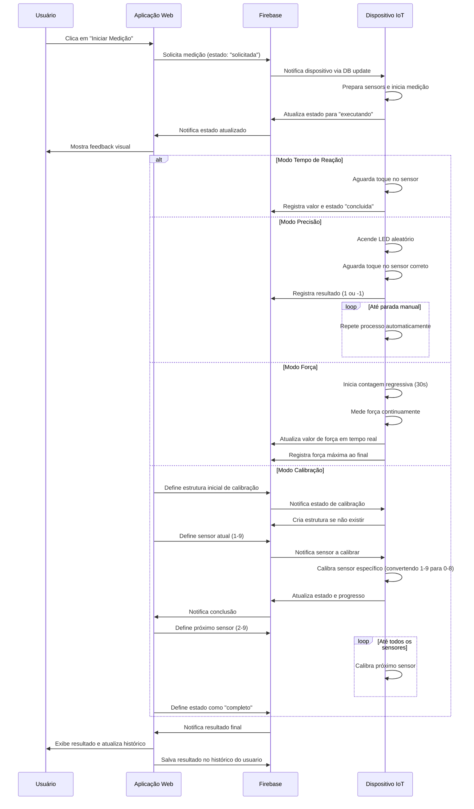

# Documentação Completa do Sistema BoxeIoT - Atualizada

## Índice
1. [Introdução](#introdução)
2. [Arquitetura do Sistema](#arquitetura-do-sistema)
3. [Estrutura de Dados](#estrutura-de-dados)
4. [Fluxo de Usuário](#fluxo-de-usuário)
5. [Funcionalidades por Página](#funcionalidades-por-página)
6. [Diagramas Técnicos](#diagramas-técnicos)
7. [Configuração e Implantação](#configuração-e-implantação)
8. [Considerações de Segurança](#considerações-de-segurança)
9. [Sincronização Site-Firmware](#sincronização-site-firmware)

## Introdução

O BoxeIoT é um sistema completo de monitoramento de sensores para equipamentos de boxe, composto por:

1. **Aplicação Web**: Interface para usuários interagirem com os dispositivos
2. **Dispositivos IoT**: Sensores acoplados a sacos de boxe para capturar dados
3. **Backend Firebase**: Processamento e armazenamento em tempo real

### Funcionalidades Principais
- **Cadastro e autenticação** de usuários
- **Gerenciamento** de dispositivos IoT
- **Teste de tempo de reação**
- **Teste de precisão/foco** 
- **Teste de força** de golpes
- **Calibração** de sensores
- **Histórico** e relatórios de desempenho

## Arquitetura do Sistema


## Estrutura de Dados

### Estrutura no Firebase Realtime Database

```
root/
├── devices/
│   └── [device_id]/
│       ├── estado: "disponivel" | "ocupado" | "manutencao"
│       ├── usuario: [user_id] (se ocupado)
│       ├── timestampConexao: [timestamp]
│       ├── medicoes/
│       │   └── ├── tipo: "tempo_reacao" | "precisao" | "forca" | "tCalibrar"
│       │       ├── estado: "solicitada" | "executando" | "concluida" | "erro" | "completo"
│       │       ├── usuario: [user_id]
│       │       ├── timestamp: [timestamp]
│       │       ├── timestampInicio: [timestamp]
│       │       ├── valor: [number] (resultado)
│       │       ├── sensor: [number] (1-9) - sensor atual sendo calibrado
│       │       ├── ledIndex: [number] (apenas para precisão)
│       │       ├── progresso/
│       │       │   ├── completos: [number] (sensores já calibrados)
│       │       │   ├── total: [number] (total de sensores)
│       │       │   └── percentual: [number] (0-100)
│       │       └── sensores_calibrados: [array] (lista de sensores já calibrados)
│       └── usuarios/
│           └── [user_id]: [timestamp] (timestamp da última conexão)
│
└── users/
    └── [user_id]/
        ├── nome: [string]
        ├── email: [string]
        ├── createdAt: [timestamp]
        └── dispositivos/
            └── [device_id]/
                ├── apelido: [string]
                └── timestamp: [timestamp]
        └── medicoes/
            ├── tempo_reacao/
            │   └── [timestamp_id]/
            │       ├── valor: [number]
            │       ├── timestamp: [timestamp]
            │       └── dispositivo: [device_id]
            ├── forca/
            │   └── [timestamp_id]/
            │       ├── valor: [number]
            │       ├── timestamp: [timestamp]
            │       └── dispositivo: [device_id]
            └── precisao/
                └── [session_id]/
                    ├── acertos: [number]
                    ├── erros: [number]
                    ├── pontuacao: [number]
                    ├── tempoTotal: [number]
                    ├── timestampInicio: [timestamp]
                    ├── timestampFim: [timestamp]
                    └── dispositivo: [device_id]
```

## Fluxo de Usuário


## Funcionalidades por Página

### 1. Página de Login (`login.html`)
- Autenticação por email/senha
- Validação de campos e exibição de mensagens de erro
- Redirecionamento automático se já autenticado

### 2. Página de Cadastro (`cadastro.html`)
- Registro de novos usuários
- Validação de senha (mínimo 6 caracteres)
- Armazenamento de dados do usuário no Realtime Database

### 3. Cadastro de Dispositivo (`cadastro-dispositivo.html`)
- Associação de dispositivos ao usuário
- Leitura de QR Code para facilitar o cadastro
- Nome personalizado para dispositivos
- Verificação de existência do dispositivo

### 4. Lista de Dispositivos (`dispositivos.html`)
- Visualização de todos os dispositivos do usuário
- Status em tempo real (disponível/ocupado/manutenção)
- Acesso rápido aos modos de treino
- Logout da aplicação

### 5. Página Principal (`index.html`)
- Dashboard com os quatro modos de treino
- Informações do dispositivo selecionado
- Status de conexão em tempo real
- Gerenciamento de conexão com dispositivos

### 6. Tempo de Reação (`tempodereacao.html`)
- Medição do tempo de resposta do usuário
- Temporizador visual durante a medição
- Histórico de resultados
- Reinício e cancelamento de medições

### 7. Precisão/Foco (`foco.html`)
- Teste de acuidade com LEDs
- Pontuação baseada em acertos/erros
- Treino contínuo até interrupção manual
- Registro de sessões de treino

### 8. Força (`forca.html`)
- Medição da força aplicada no saco de boxe
- Contador regressivo de 30 segundos
- Barra de progresso e valor numérico da força
- Registro da força máxima aplicada

## Diagramas Técnicos

### Diagrama de Sequência - Processo de Medição



### Diagrama de Estados - Dispositivo IoT


### Diagrama de Componentes


## Configuração e Implantação

### Pré-requisitos
1. Conta no Firebase (https://firebase.google.com)
2. Projeto Firebase criado
3. Dispositivos IoT configurados e conectados à mesma base de dados

### Configuração do Firebase
1. Criar projeto no console Firebase
2. Ativar Authentication (com provedor Email)
3. Criar Realtime Database com regras de segurança:

```javascript
{
  "rules": {
    "users": {
      "$uid": {
        // Apenas o próprio usuário pode ler e escrever seus dados
        ".read": "$uid === auth.uid",
        ".write": "$uid === auth.uid"
      }
    },
    "devices": {
      "$device_id": {
        // Qualquer usuário autenticado pode ler dados dos dispositivos
        ".read": "auth != null",
        // Qualquer usuário autenticado pode escrever dados dos dispositivos
        ".write": "auth != null"
      }
    }
  }
}
```

4. Registrar aplicativo web no projeto e obter configuração
5. Substituir configuração no código de todas as páginas:

```javascript
const firebaseConfig = {
  apiKey: "SUA_API_KEY",
  authDomain: "SEU_PROJETO.firebaseapp.com",
  databaseURL: "https://SEU_PROJETO.firebaseio.com",
  projectId: "SEU_PROJETO",
  storageBucket: "SEU_PROJETO.appspot.com",
  messagingSenderId: "123456789",
  appId: "SEU_APP_ID"
};
```

### Implantação
1. Instalar Firebase CLI: `npm install -g firebase-tools`
2. Fazer login: `firebase login`
3. Inicializar projeto: `firebase init`
   - Selecionar Hosting e Realtime Database
   - Especificar pasta pública (ex: `public`)
   - Configurar como SPA (single page app)
4. Fazer deploy: `firebase deploy`

## Considerações de Segurança

1. **Autenticação**: Todos os usuários devem se autenticar para acessar o sistema
2. **Autorização**: Usuários só acessam seus próprios dados e dispositivos
3. **Validação**: Todas as entradas são validadas no frontend e backend
4. **Conexão Segura**: Firebase usa HTTPS para todas as comunicações
5. **Controle de Acesso**: Dispositivos usam sistema de bloqueio para acesso exclusivo

### Melhorias Futuras
- Implementar sistema de recuperação de senha
- Adicionar mais provedores de autenticação
- Implementar notificações para eventos importantes
- Desenvolver aplicativo mobile nativo

## Sincronização Site-Firmware

### Problemas Resolvidos

#### 1. Incompatibilidade na Numeração dos Sensores
- **Firmware**: Utilizava índices de 0 a 8 para os sensores
- **Interface Web**: Esperava números de 1 a 9 para os sensores
- **Solução**: O firmware agora converte os índices (1-9 da interface para 0-8 internamente)

#### 2. Falta de Campo `sensor` na Estrutura de Dados
- Implementado campo `sensor` em `medicoes` para indicar qual sensor calibrar
- Adicionados campos de progresso (`completos`, `total`, `percentual`)

#### 3. Estrutura de Dados Incompleta
- Adicionada estrutura completa em `medicoes` para suportar o processo de calibração
- Implementada criação automática da estrutura quando não existir

#### 4. Comunicação Unidirecional
- Implementada comunicação bidirecional com o firmware escrevendo na estrutura do Firebase
- Adicionada capacidade do firmware criar a estrutura de dados inicial se necessário

### Novas Funções Implementadas

#### No Firmware (Conexao.cpp):
1. **`getSensorCalibracao()`**: Obtém o sensor atual a ser calibrado do Firebase, criando a estrutura se necessário
2. **`setSensorCalibracao(int sensor)`**: Define o sensor atual a ser calibrado no Firebase
3. **`updateDeviceEx()`**: Inicializa todos os campos necessários para a calibração
4. **`sendSensorCalibrated(int sensor)`**: Notifica que um sensor foi calibrado com sucesso

#### Fluxo de Calibração Atualizado:
1. Interface web inicia calibração e define a estrutura de dados
2. Firmware detecta comando e entra no estado de calibração
3. Interface web define sequencialmente os sensores a calibrar (1-9)
4. Firmware calibra cada sensor (convertendo 1-9 para 0-8) e atualiza o progresso
5. Interface web monitora progresso e define próximo sensor
6. Ao final, interface web define estado como "completo"

### Benefícios da Nova Implementação

1. **Simplicidade**: Interface web controla a sequência, firmware executa a calibração
2. **Robustez**: Menos pontos de falha na comunicação com timeouts e tratamento de erros
3. **Manutenibilidade**: Código mais fácil de entender e modificar
4. **Experiência do Usuário**: Feedback visual claro sobre o andamento da calibração
5. **Resiliência**: Sistema cria automaticamente estrutura de dados se não existir

### Detalhes Técnicos das Melhorias

#### Modificação na Função `getSensorCalibracao()`
- Adicionada verificação de erro para o caso de caminho não existir
- Implementada criação da estrutura inicial se o caminho não existir

#### Nova Função `setSensorCalibracao()`
- Permite ao firmware definir o sensor atual a ser calibrado
- Facilita a comunicação bidirecional

#### Atualização da Tarefa de Calibração
- Verificação contínua do sensor atual a ser calibrado
- Atualização do display quando o sensor muda
- Conversão automática de índices (1-9 para 0-8)

#### Melhoria na Função `updateDeviceEx()`
- Inicialização completa de todos os campos necessários para calibração
- Definição de valores padrão para progresso e percentual

Esta documentação cobre todos os aspectos principais do sistema BoxeIoT, incluindo as recentes melhorias na sincronização entre a interface web e o firmware. Para informações mais detalhadas sobre implementação específica, consulte os comentários no código-fonte de cada página.
