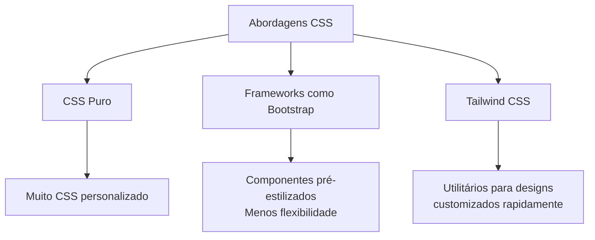
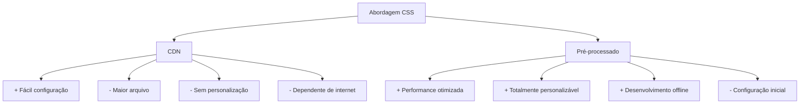

# Tutorial: Configuração do Tailwind CSS v3 com Firebase Hosting

## Sumário
1. [Introdução](#introdução)
2. [Pré-requisitos](#pré-requisitos)
3. [Teoria: Por que Tailwind CSS?](#teoria-por-que-tailwind-css)
4. [Estrutura do Projeto](#estrutura-do-projeto)
5. [Configuração Passo a Passo](#configuração-passo-a-passo)
6. [Métodos de Trabalho](#métodos-de-trabalho)
7. [Implantação no Firebase](#implantação-no-firebase)
8. [Testes e Validação](#testes-e-validação)
9. [Conclusão](#conclusão)

## Introdução

Este tutorial guiará você na configuração do Tailwind CSS v3 em um projeto estático com deploy no Firebase Hosting. O Tailwind CSS é um framework CSS utilitário que permite construir designs rapidamente sem sair do seu HTML.

## Pré-requisitos

- Node.js e npm instalados
- Conta no Google Firebase
- Firebase CLI instalado (`npm install -g firebase-tools`)
- Conhecimento básico de HTML, CSS e JavaScript

## Teoria: Por que Tailwind CSS?

### Vantagens do Tailwind CSS
- **Baixo acoplamento**: As classes utilitárias são isoladas e não dependem de outros estilos.
- **Personalização**: Configuração via `tailwind.config.js` para adaptar o design system.
- **Performance**: Apenas as classes utilizadas são incluídas no build final.
- **Produtividade**: Desenvolvimento rápido com classes predefinidas.

### Comparação com Abordagens Tradicionais


## Estrutura do Projeto

A estrutura de pastas recomendada é:

```
meu-projeto-firebase/
├── public/                 # Pasta de build (gerada automaticamente)
│   ├── index.html
│   ├── login.html
│   └── styles.css         # CSS gerado pelo Tailwind
├── src/
│   ├── styles/
│   │   └── input.css      # Arquivo de entrada do Tailwind
│   ├── index.html         # Desenvolvimento
│   └── login.html         # Desenvolvimento
├── tailwind.config.js     # Configuração do Tailwind
├── build.js              # Script de build personalizado
├── package.json
└── firebase.json         # Configuração do Firebase
```

## Configuração Passo a Passo

### 1. Inicialização do Projeto

```bash
# Crie a pasta do projeto e navegue até ela
mkdir meu-projeto-firebase
cd meu-projeto-firebase

# Inicialize o npm
npm init -y

# Instale o Tailwind CSS v3 (use aspas para evitar problemas no ZSH)
npm install -D "tailwindcss@^3.4.0"

# Inicialize o Tailwind CSS
npx tailwindcss init
```

### 2. Configuração do Tailwind

Edite o arquivo `tailwind.config.js`:

```javascript
/** @type {import('tailwindcss').Config} */
module.exports = {
  content: ["./src/**/*.html"],
  theme: {
    extend: {
      colors: {
        'boxeiot-primary': '#1a2a6c',
        'boxeiot-secondary': '#b21f1f', 
        'boxeiot-accent': '#fdbb2d',
      },
      backgroundImage: {
        'boxeiot-gradient': 'linear-gradient(135deg, #1a2a6c, #b21f1f, #fdbb2d)',
      }
    },
  },
  plugins: [],
}
```

### 3. Arquivo de Entrada do CSS

Crie a pasta e o arquivo `src/styles/input.css`:

```css
@tailwind base;
@tailwind components;
@tailwind utilities;

@layer components {
  .btn {
    @apply inline-flex items-center justify-center px-4 py-2 rounded-lg font-semibold transition-colors;
  }
  .btn-primary {
    @apply bg-blue-600 text-white hover:bg-blue-700;
  }
  /* Adicione mais componentes conforme necessário */
}
```

### 4. Script de Build

Crie um arquivo `build.js`:

```javascript
const { execSync } = require('child_process');
const fs = require('fs');
const path = require('path');

console.log('🔄 Building CSS with Tailwind...');

// Build do CSS
execSync('npx tailwindcss -i ./src/styles/input.css -o ./public/styles.css --minify', { 
  stdio: 'inherit'
});

// Copiar arquivos HTML
console.log('📁 Copying HTML files...');
if (!fs.existsSync('./public')) {
  fs.mkdirSync('./public');
}

const files = fs.readdirSync('./src');
files.forEach(file => {
  if (path.extname(file) === '.html') {
    fs.copyFileSync(`./src/${file}`, `./public/${file}`);
    console.log(`✅ Copied: ${file}`);
  }
});

console.log('🎉 Build completed!');
```

### 5. Configuração do package.json

Adicione os scripts ao `package.json`:

```json
{
  "scripts": {
    "build": "node build.js",
    "dev": "npm run build && firebase serve",
    "deploy": "npm run build && firebase deploy --only hosting"
  }
}
```

### 6. Configuração do Firebase

Se você ainda não inicializou o Firebase:

```bash
firebase login
firebase init hosting
```

Selecione seu projeto e configure o `public` como pasta pública.

## Métodos de Trabalho

### Desenvolvimento Local
1. Edite os arquivos na pasta `src/`.
2. Execute `npm run dev` para build e servidor local.
3. Acesse `http://localhost:5000` para visualizar.

### Watch Mode para CSS
Para assistir automaticamente as mudanças no CSS, em outro terminal:

```bash
npx tailwindcss -i ./src/styles/input.css -o ./public/styles.css --watch
```

### Estrutura de Desenvolvimento
- **src/index.html**: Página principal com classes Tailwind.
- **src/styles/input.css**: Importações do Tailwind e componentes personalizados.

Exemplo de HTML:

```html
<!DOCTYPE html>
<html lang="pt-BR">
<head>
  <meta charset="UTF-8">
  <meta name="viewport" content="width=device-width, initial-scale=1.0">
  <title>Meu Projeto</title>
  <link href="/styles.css" rel="stylesheet">
</head>
<body class="bg-boxeiot-gradient min-h-screen flex items-center justify-center">
  <div class="card bg-white/95 rounded-xl shadow-xl p-8">
    <h1 class="text-3xl font-bold text-boxeiot-primary">Olá Mundo!</h1>
    <button class="btn btn-primary mt-4">Clique aqui</button>
  </div>
</body>
</html>
```

## Implantação no Firebase

### Build para Produção
```bash
npm run build
```

Isso irá:
- Processar o CSS do Tailwind (minificado)
- Copiar os arquivos HTML para a pasta `public/`
### para rodar localmente
```bash
npm run watch
```
em outro terminal rode 

```bash
firebase serve 
```

### Deploy
```bash
npm run deploy
```

Este comando fará o build e em seguida o deploy no Firebase Hosting.

## Testes e Validação

### Testes de Build
- Sempre execute `npm run build` localmente para verificar erros.
- Verifique se o arquivo `public/styles.css` foi gerado e contém estilos.

### Validação de HTML
- Use o [Validador de HTML](https://validator.w3.org/) para verificar a sintaxe.

### Testes de Responsividade
- Teste em diferentes dispositivos ou use as ferramentas do navegador.

### Testes de Deploy
- Após o deploy, acesse a URL fornecida pelo Firebase.
- Verifique se todos os recursos carregam corretamente.

## Conclusão

A combinação do Tailwind CSS v3 com Firebase Hosting oferece uma stack moderna para desenvolvimento front-end. O Tailwind acelera o desenvolvimento com suas classes utilitárias, e o Firebase proporciona deploy e hospedagem simples e confiáveis.

Este fluxo de trabalho permite que você mantenha o código organizado, com separação entre desenvolvimento (pasta `src`) e build (pasta `public`), e aproveite as vantagens do Tailwind CSS com a facilidade de deploy do Firebase.

## Recursos Adicionais

- [Documentação do Tailwind CSS](https://tailwindcss.com/docs)
- [Documentação do Firebase Hosting](https://firebase.google.com/docs/hosting)

---
# Análise sobre o uso do Tailwind CSS pré-processado no Firebase

O Firebase Hosting é otimizado para servir arquivos estáticos, e usar o Tailwind CSS pré-processado (com build local) oferece vantagens significativas em comparação com o uso via CDN.

## Vantagens do Tailwind pré-processado no Firebase:

### 1. Performance otimizada
- **CSS menor**: Apenas as classes utilizadas são incluídas no build final
- **Menos requisições**: Elimina a dependência externa do CDN
- **Maior velocidade de carregamento**: Arquivo local é servido mais rapidamente

### 2. Maior controle e personalização
- **Tema personalizável**: Configuração completa através do `tailwind.config.js`
- **Componentes customizados**: Criação de classes próprias com `@apply`
- **Otimização específica**: Build adaptado ao seu projeto

### 3. Melhor experiência de desenvolvimento
- **Hot-reload**: Atualização automática durante o desenvolvimento
- **Debug mais fácil**: Identificação precisa de problemas de estilização
- **Consistência visual**: Garantia de que todos usam a mesma versão

### 4. Segurança e confiabilidade
- **Sem dependências externas**: Não depende da disponibilidade do CDN
- **Controle de versões**: Versão específica do Tailwind no seu projeto
- **Offline development**: Desenvolvimento possível sem conexão à internet

## Comparação: CDN vs Pré-processado



## Conclusão

Para um projeto profissional como o BoxeIoT, usar o Tailwind CSS pré-processado é a melhor opção. A configuração inicial é um pouco mais trabalhosa, mas as vantagens em performance, personalização e controle justificam plenamente esse investimento.

O erro que você encontrou foi apenas uma questão de sintaxe (classes inexistentes), que já foi resolvida com a correção para usar valores arbitrários (`border-[3px]`, `w-[70%]`).